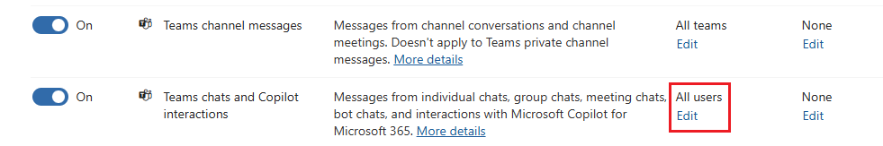

---
lab:
  task: Configure Retention Policies
  exercise: Exercise 1 - Configure Retention Policies
---

## WWL 租户 - 使用条款

如果在讲师引导式培训过程中向你提供租户，请注意，提供租户旨在支持讲师引导式培训中的动手实验室。

租户不应共享或用于动手实验室以外的用途。 本课程使用的租户为试用租户，课程结束后无法使用或访问，不符合扩展条件。

租户不得转换为付费订阅。 在本课程中获得的租户仍然是 Microsoft Corporation 的财产，我们保留随时获取访问权限和收回的权利。

# 练习 1 技能任务

你的任务是创建和管理符合所需条件的保留策略：

- **公司范围内的保留策略**：应用保留期并设置此策略的位置。
- **基于位置的保留策略**：为特定位置（例如 Teams 频道和聊天，包括特定用户）创建保留策略。
- **PowerShell 保留策略**：使用 PowerShell 实施保留策略。
- **自适应范围策略**：为法律和零售等部门创建和应用具有自适应范围的保留策略。

## 任务 1 - 创建公司范围内的保留策略

在这里，你将创建适用于整个组织的保留策略。

1. 在 Microsoft Edge 中，导航到 Microsoft Purview 门户，`https://purview.microsoft.com`，然后登录。
1. 有关新的 Microsoft Purview 门户的消息将显示在屏幕上。 选择同意数据流披露条款和隐私声明选项，然后选择“**开始使用**”。

    >

1. 选择“**解决方案**” > “**数据生命周期管理**”。
1. 在左侧导航窗格中，展开“**策略**”，然后选择“**保留策略**”。
1. 选择“**+ 新建保留策略**”。
1. 在“**为保留策略命名**”页上，输入名称和说明：

   - **名称**：`Company wide`
   - **说明**：`All locations except for teams`

1. 选择**下一步**。
1. 在“策略范围”页上，选择“下一步”。
1. 在“**选择要创建的保留策略的类型**”页上，选择“**静态**”，然后选择“**下一步**”。
1. 在“**选择应用此策略的位置**”页上，启用：

   - Exchange 邮箱
   - SharePoint 经典和通信站点
   - OneDrive 帐户
   - Microsoft 365 组邮箱和站点

1. 选择**下一步**。
1. 在“确定是想要保留内容还是删除内容或两者兼而有之”页上的“将项保留特定时间段”部分中，输入以下信息 ：

   - 将项保留特定时间段：从下拉列表中选择“自定义”********
   - 将“年数”字段更改为 3
   - 保留期开始依据：上次修改项的时间
   - 保留期结束时：自动删除项

1. 选择**下一步**。
1. 在“查看并完成”页面上，选择“提交” 。
1. 创建策略后，选择“**完成**”。

你已成功创建了一个公司范围内的保留策略，该策略自上次修改日期起将项目保留三年。

## 任务 2 - 使用筛选器创建基于位置的保留策略

在这里，你将专门为 Teams 频道和聊天创建保留策略，包括特定用户的筛选器。

1. 你应仍位于 Microsoft Purview 门户的“**保留策略**”屏幕上。

   如果没有，在 Microsoft Edge 中，导航到 Microsoft Purview 门户，`https://purview.microsoft.com`，然后登录。 登录后，选择“**数据生命周期管理**” > “**策略**” > “**保留策略**”卡。

1. 选择“**+ 新建保留策略**”。
1. 在“**为保留策略命名**”页上，输入名称和说明：

   - **名称**：`Teams Retention`
   - **说明**：`Retention for Teams locations`

1. 选择**下一步**。
1. 在“策略范围”页上，选择“下一步”。
1. 在“**选择要创建的保留策略的类型**”页上，选择“**静态**”，然后选择“**下一步**”。
1. 在“选择应用策略的位置”部分，启用：

   - Teams 渠道消息
   - Teams 聊天和 Copilot 交互

   确保禁用所有其他选项。

1. 对于“**Teams 聊天和 Copilot 交互**”位置，选择“**所有用户**”下的“**编辑**”链接，并添加两个用户。

    >

1. 在“**Teams 聊天和 Copilot 交互**”浮出控件页上，添加用户后，选择“**完成**”，然后选择“**下一步**”。
1. 在“**决定是否要保留和/或删除内容**”页上，输入：
   - **将项目保留一段特定时间**：从下拉列表中选择“**自定义**”。
   - 将“年数”字段更改为“3”。
   - **保留期开始依据**：上次修改项的时间。

1. 选择**下一步**。
1. 在“查看并完成”页面上，选择“提交” 。
1. 创建策略后，选择“**完成**”。

你已成功为具有三年保留期的 Teams 位置创建保留策略，并为特定用户应用筛选器。

## 任务 3 - 通过 PowerShell 创建保留策略

在此任务中，你将使用 PowerShell 创建和管理保留策略。

1. 打开提升权限的 PowerShell 窗口。
1. 输入以下 cmdlet，安装最新版 Exchange Online PowerShell 模块：

    ```powershell
    Install-Module ExchangeOnlineManagement
    ```

1. 输入表示“是”的 Y 并按 Enter 键，以确认“NuGet 提供程序安全”对话框 。 此过程可能需要一段时间才能完成。
1. 输入表示“是”的 Y 并按 Enter 键，以确认“不受信任的存储库安全”对话框 。  此过程可能需要一段时间才能完成。
1. 输入以下 cmdlet 以更改执行策略，然后按 **Enter** 键。 该命令假定你以具有适当权限的用户身份登录。

    ```powershell
    Set-ExecutionPolicy -ExecutionPolicy RemoteSigned -Scope CurrentUser
    ```

1. 单击表示“是”的 Y 并按 Enter 键，以确认“执行策略更改” 。
1. 关闭 PowerShell 窗口。
1. 在不提升权限的情况下打开常规 PowerShell 窗口，方法是右键选择 Windows 按钮，然后选择“Windows PowerShell”。
1. 使用以下 cmdlet 连接到租户中的“安全与合规中心”：

    ```powershell
    Connect-IPPSSession
    ```

1. 如果出现提示，请以具有相应权限的用户身份登录。
1. 运行以下 cmdlet 为所有位置（Teams 除外）创建第一个保留策略：

    ```powershell
    New-RetentionCompliancePolicy -Name "Company Wide PS" -ExchangeLocation All -ModernGroupLocation All -SharePointLocation All -OneDriveLocation All
    ```

1. 运行以下 cmdlet 以基于修改的日期设置保留期（以天为单位）：

    ```powershell
    New-RetentionComplianceRule -Name "Company Wide PS Rule" -Policy "Company Wide PS" -RetentionDuration 1095 -ExpirationDateOption ModificationAgeInDays -RetentionComplianceAction Keep
    ```

你已通过 PowerShell 成功创建了保留策略，其保留期为三年。

## 任务 4 - 创建具有自适应范围的保留策略

在这里，你将针对特定部门（如法律部和零售部）创建一个具有自适应范围的保留策略。

1. 在 Microsoft Edge 中，导航到 Microsoft Purview 门户，`https://purview.microsoft.com`，然后登录。
1. 从左侧导航栏中选择“设置”。
1. 展开“**角色和范围**”，然后选择“**自适应范围**”。
1. 在“自适应范围”页上，选择“+ 创建范围”********。
1. 在“**为自适应策略范围命名**”页上，输入：

   - **名称**：`Legal Documents Retention`
   - **说明**：`Retention for legal related documents`

1. 选择**下一步**。
1. 在“**分配管理单元**”页上，选择“**下一步**”。
1. 在“**想要创建哪种类型的范围?**”页上，选择“**用户**”，然后选择“**下一步**”。
1. 在“**创建查询以定义用户**”页的“**用户属性**”下，选择：

   - 属性：部门
   - 运算符：等于
   - **值**：`Legal`

1. 选择带值的“**+ 添加属性**”按钮以添加第二个属性：

   - 查询运算符：或
   - 属性：部门
   - 运算符：等于
   - **值**：`Retail`

    >

1. 选择“**下一步**”，然后选择“**查看并完成**”页上的“**提交**”。
1. 创建范围后，选择“**完成**”返回到“**自适应范围**”页。
1. 选择“**解决方案**” > “**数据生命周期管理**”。
1. 展开“**策略**”，然后选择“**保留策略**”。
1. 在“**保留策略**”页上，选择“**+ 新建保留策略**”。
1. 在“**命名保留策略**”页上输入：

   - **名称**：`Legal Data Retention`
   - **说明**：`Retention of all documents within the legal and retail departments.`

1. 选择**下一步**。
1. 在“策略范围”页上，选择“下一步”。
1. 在“**选择要创建的保留策略的类型**”页上，选择“**自适应**”，然后选择“**下一步**”。
1. 在“**选择自适应策略范围和位置**”页上，选择“**+ 添加范围**”，然后选择“**法律文档保留**”范围。
1. 在“**选择要应用策略的位置**”下，启用：

   - Exchange 邮箱
   - OneDrive 帐户

1. 选择**下一步**。
1. 在“**决定是否要保留和/或删除内容**”页上，输入：

   - 将项保留特定期限：5 年
   - 保留期开始依据：项创建时间
   - 保留期结束时：无操作

1. 选择“**下一步**”，然后选择“**查看并完成**”上的“**提交**”。
1. 创建策略后，选择“**完成**”。

你已成功将自适应范围应用于保留策略。
