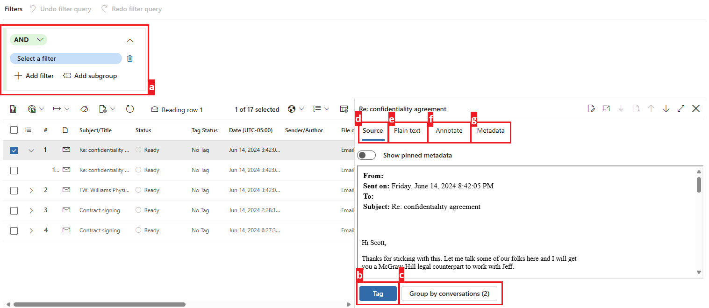

---
lab:
  task: Case investigation with eDiscovery (Premium)
  exercise: Exercise 3 - Case investigation with eDiscovery (Premium)
---

## WWL 租户 - 使用条款

如果在讲师引导式培训过程中向你提供租户，请注意，提供租户旨在支持讲师引导式培训中的动手实验室。

租户不应共享或用于动手实验室以外的用途。 本课程使用的租户为试用租户，课程结束后无法使用或访问，不符合扩展条件。

租户不得转换为付费订阅。 在本课程中获得的租户仍然是 Microsoft Corporation 的财产，我们保留随时获取访问权限和收回的权利。

# 练习 3 个技能任务

你的任务是创建和管理符合调查条件的电子数据展示案例：

- **创建新的电子数据展示案例**：设置新案例以开始调查。
- **向案件添加保管人**：包括可能具有相关数据的相关个人。
- **创建并运行收集估算**：分析调查的数据量和相关性。
- **查看和优化集合估算**：确保集合符合条件。
- **将集合提交到审阅集**：准备数据以供详细分析。
- **导出搜索结果**：保存收集的数据以供进一步查看，达到合规目的。

>**注意**：此实验室假定有权访问 M365 E5 租户，该租户包含开展调查需要浏览的数据。 你仍然可以在没有数据的情况下完成此练习，但集合和评审集不会产生任何结果。

## 任务 1 - 授予电子数据展示（高级版）的权限

若要导出文件，需要特定权限，因为此选项授予对用户文件的直接访问权限。

1. 在 Microsoft Edge 中，导航到 Microsoft Purview 门户，`https://purview.microsoft.com`，然后登录。
1. 选择“**设置**”卡。

   如果未看到“**设置**“卡，请选择“**查看所有解决方案**”，并选择“**核心**”部分下的“**设置**”卡。

1. 在左侧导航窗格中，展开“**角色和范围**”，然后选择“**角色组**”。
1. 在“**Microsoft Purview 解决方案的角色组**”上，选择“**电子数据展示管理员**”。
1. 在右侧的“**电子数据展示管理员**”浮出控件页上，选择“**编辑**”。
1. 在“管理电子数据展示管理员”页上，选择“选择用户”。
1. 在右侧的“**选择用户**”浮出控件页上，选择要用于执行此交互式练习的用户，然后选择“**选择**”。
1. 回到“**管理电子数据展示管理员**”页上，选择“**下一步**”。
1. 在“管理电子数据展示管理员”页上，选择“下一步”。
1. 在“**检查角色组并完成**”页上，选择“**保存**”以将用户添加到电子数据展示管理员角色组。
1. 成功添加用户后，请在“**你已成功更新角色组**”页面上选择“**完成**”。
1. 选择“**主页**”以导航回 Microsoft Purview 门户的主页。

你已成功授予电子数据展示管理员权限。

## 任务 2 - 创建电子数据展示（高级版）案例

获得必要的权限后，就可以创建新的电子数据展示案例以开始调查。

1. 你应该位于 Microsoft Purview 门户主页上。

   如果没有，在 Microsoft Edge 中，导航到 Microsoft Purview 门户，`https://purview.microsoft.com`，然后登录。

1. 选择“**查看所有解决方案**”。
1. 在“**风险与合规性**”下，选择”**电子数据展示**“卡。
1. 在左侧导航窗格中，展开“**高级案例**”，然后选择“**案例**”。
1. 在“**电子数据展示(高级版)**”页上，选择“**+ 创建案例**”。
1. 在右侧的“**为案例命名**”浮出控件页上，输入：

   - **名称**：`Legal Investigation 2024`
   - **说明**：`eDiscovery case for the 2024 legal investigation involving relevant emails and documents.`

1. 在“**添加团队成员并配置设置**”页上，确保添加将进行调查的用户，然后选择“**下一步**”。
1. 在“**查看案例**”页上，选择“**提交**”，然后选择“**完成**”。

你已成功创建一个新的名为“_法律调查 2024_”的电子数据展示案例。

## 任务 3 – 向案例添加保管人

创建案例后，需要添加保管人。 保管人是可能掌握调查所需相关信息的个人。

1. 在上一任务中创建案例后，你应位于“**法律调查 2024**”案例的“**概述**”选项卡中。

   如果没有，在 Microsoft Edge 中，导航到 Microsoft Purview 门户，`https://purview.microsoft.com`，然后登录。 选择“**风险与合规性**”部分下的**电子数据展示**卡。 选择“**高级案例**” > “**案例**”，然后选择新创建的“**法律调查 2024**”案例。

1. 从顶部导航中选择“**数据源**”选项卡，然后选择“**添加数据源**” > “**添加新保管人**”。
1. 在“**新建保管人**”浮出控件页的“**选择保管人**”下，向案例添加保管人，然后选择“**下一步**”。
1. 在“**保留设置**”页上，确保选择在上一步中添加的保管人以进行保留。
1. 在“**查看保管人**”页上，选择“**提交**”，然后在创建新保管人后选择“**完成**”。

你已成功将保管人添加到“_法律调查 2024_”案例。

## 任务 4 - 创建并运行集合估算

添加保管人后，现在可以运行集合估算，大致了解数据量和相关性。

1. 在上一任务中将保管人添加到案例后，你仍应位于“**法律调查 2024**”案例的“**数据源**”选项卡中。  

   如果没有，在 Microsoft Edge 中，导航到 Microsoft Purview 门户，`https://purview.microsoft.com`，然后登录。 选择“**风险与合规性**”部分下的**电子数据展示**卡。 选择“**高级案例**” > “**案例**”，然后选择新创建的“**法律调查 2024**”案例。

1. 从顶部导航中选择“**集合**”选项卡，然后选择“**+ 新建集合**”。
1. 在“**新建集合**”配置中，为集合提供“**名称和说明**”。 输入：

   - **名称**：`Legal Data Collection`
   - **说明**：`Collecting emails and documents relevant to the 2024 legal investigation.`

1. 选择**下一步**。
1. 在“**选择保管数据源**”上，选择“**+ 选择保管人**”。
1. 在右侧的“**选择保管人**”浮出控件页上，添加上一任务中添加到案例的保管人，然后选择“**添加**”。
1. 返回“**选择保管数据源**”页，选择“**下一步**”。
1. 在“**选择非保管数据源**”上，选择“**下一步**”。
1. 在“**其他位置**”上，将以下位置的状态设置为“**开启**”：

   - Exchange 邮箱
   - Exchange 公用文件夹

1. 选择**下一步**。
1. 在“**定义搜索查询**”页上，使用查询生成器生成搜索以查找与案例相关的内容：

   - 使用 **AND** 运算符搜索“**等于**”`legal` 的“**关键字**”。
   - 选择“**添加子组**”。
   - 使用 **OR** 运算符搜索“**等于**”`contract` 的“**关键字**”。

    >

1. 选择**下一步**。
1. 在“**查看并创建集合**”页上，选择“**提交**”，然后在“**已创建新集合**”页上选择“**完成**”。
1. 返回“**集合**”页，查看集合估算的进度。 使用“**刷新**”按钮刷新页面并检查集合估算的状态。 估算状态更新为“**已估算**”且“**预览状态**”更新为“**成功**”后，集合估算完成。

    >

    >**提示**：集合估算完成后，可以随意试验生成不同的查询或使用 KQL 编辑器进行更高级的搜索。 为此，请选中集合估算左侧的复选框，然后选择“**编辑集合**”。 这会将你直接带到“**定义搜索查询**”页。 可以修改查询并提交新的集合估算，以探索查询如何对集合估算造成更改。

1. 选择“**法律数据集合**”并浏览集合估算。

   - **“摘要”选项卡**：提供集合统计信息的概述，包括检索的项、命中的位置以及文件类型。
   - “**数据源”选项卡**：显示有关集合中包含的保管和非保管数据源的信息。
   - **“搜索统计信息”选项卡**：显示上一集合估算中的详细统计信息，包括项数和数据量。
   - **“集合选项”选项卡**：列出和说明配置集合时可用的不同选项，例如云附件和对话线程。

    >

已成功创建并审阅名为“_法律数据集合_”的集合。

## 任务 5 - 提交集合到审阅集

对集合感到满意后，请将其提交到审阅集进行详细分析。

1. 在上一任务中创建集合估算后，仍应位于“**法律调查 2024**”案例的“**集合**”选项卡中。  

   如果没有，在 Microsoft Edge 中，导航到 Microsoft Purview 门户，`https://purview.microsoft.com`，然后登录。 选择“**风险与合规性**”部分下的**电子数据展示**卡。 选择“**高级案例**” > “**案例**” > “**法律调查 2024**” > “**集合**”选项卡。

1. 选择“**法律数据集合**”集合。
1. 在右侧的“**法律数据集合**”浮出控件页上，选择“**提交集合**”。
1. 在“**将项提交到审阅集**”页上，确保已选择“**添加到新审阅集**”选项，并将其命名为 `Legal Case Review`。
1. 保留其他默认值的选定状态，然后选择“**提交**”以将集合提交到审阅集。

已成功将集合提交到审阅集。

## 任务 6 - 浏览审阅集

1. 将集合提交到上一任务中的审阅集后，仍应位于“**法律调查 2024**”案例的“**集合**”选项卡中。

   如果没有，在 Microsoft Edge 中，导航到 Microsoft Purview 门户，`https://purview.microsoft.com`，然后登录。 选择“**风险与合规性**”部分下的**电子数据展示**卡。 选择“**高级案例**” > “**案例**” > “**法律调查 2024**”。

1. 从顶部导航中选择“**审阅集**”选项卡，然后选择新创建的“**法律案例审阅**”审阅集。
1. 在右侧的“**法律案例审阅**”浮出控件页上，选择页面底部的“**打开审阅集**”。
1. 浏览对审阅集中的项可以执行的操作：

   1. **筛选器**：允许应用条件以缩小审阅集中显示的项的范围。
   1. **标记**：使你能够使用特定标记来标记文档，以便更好地组织和识别。
   1. **组**：允许按相关项目（如家庭或对话）组织审阅集内容。
   1. **视图源**：提供所选文档的丰富视图，并以原始格式显示文档。
   1. **查看纯文本**：显示文档的提取文本，忽略嵌入的图像和格式。
   1. **批注**：允许用户对文档应用标记、修订和其他批注。
   1. **查看元数据**：显示与所选文档关联的各种元数据以获取详细见解。

    >

1. 浏览审阅集后，可以导出项以供进一步分析。

已成功打开并查看审阅集。

## 任务 7 - 导出搜索结果

若要保存工作并实现进一步分析，请导出搜索结果。

1. 你仍应位于电子数据展示（高级版）中的“**法律案例审阅**”审阅集中。

   如果没有，在 Microsoft Edge 中，导航到 Microsoft Purview 门户，`https://purview.microsoft.com`，然后登录。 选择“**风险与合规性**”部分下的**电子数据展示**卡。 选择“**高级案例**” > “**案例**” > “**法律调查 2024**” > “**审阅集**”选项卡 > “**法律案例审阅**”。

1. 选中要导出的项目旁边的复选框进行进一步分析。
1. 选择“**操作**” > “**导出**”下拉列表。

    >

1. 在右侧的“**导出选项**”浮出控件页上，输入：

   - **导出名称**：`LegalCaseExport_July2024`
   - **说明**：`Export of relevant emails and documents for the July 2024 legal case investigation.`
   - **导出这些文档**：仅选定文档
   - **展开选择**：无
   - **输出选项**：经过精简的目录结构

1. 选择浮出控件页底部的“**导出**”按钮。

    >

1. 应会收到一条通知，指出“**已创建作业**”以导出审阅集。 在此通知上选择“**确定**”。
1. 若要访问导出的审阅集，请从左侧导航窗格中展开“**高级案例**”，然后选择“**案例**”。 从顶部导航中依次选择“**法律调查 2024**”案例、“**导出**”选项卡。
1. 选择 **LegalCaseExport_July2024** 导出。
1. 在右侧的“**LegalCaseExport_July2024**”浮出控件页上，选中每个导出文件左侧旁边的复选框，然后选择“**下载**”。 这将下载已导出项的 .csv 摘要和 zip 文件。

    >**提示**：可能需要禁用弹出窗口阻止程序才能成功下载导出的文件。

已成功导出搜索结果以供审阅。
